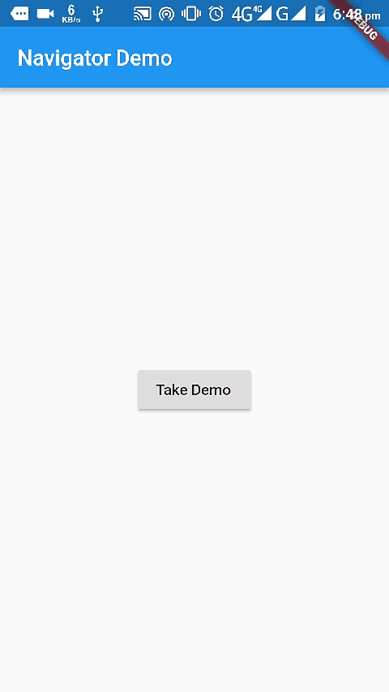

# demo

<a href="https://drive.google.com/file/d/1_Dkb2YOfKSrWd3qjkvYw1ka5_qmOWO6Q"> Example source code is here </a>
<br />

<h3> navigate </h3>

A new Flutter package for Byutifull navigation

# Why develop this package

A flutter have a package name a fluro. Fluro is a nice package and easy to use but they have some limitation. If i need to pass a parameter in Map, List type variable that not allow me. Fluro allow only string but in real time that's not good.

App development its diff from web development in web development we need to pass only small amount of data like id, slug or etc but in App development we need to pass data  between screen is object , array or etc.

## Getting Started

 Step 1: install navigator <br />
```
navigator: 0.0.4
```

 Step 2: Create new folder  `lib\config`  
 Step 3: Create file in folder `lib\config\route.dart`
<br />

```
import 'package:flutter/material.dart';
import 'package:navigate/navigate.dart';
import 'package:testpackage/main.dart';


/* define your handler here or create new file for handler */

var homeHandler = Handler(
  transactionType: TransactionType.fromRight,
  pageBuilder: (BuildContext context,arg){

      /* return your page from here */
      return HomePage(replaceRoute: arg["replaceRoute"],transactionType: arg["transactionType"],);
  }
);


/* define your route here */
Map<String,Handler> route = {
    "home" : homeHandler
 };
```
<br />
Work of above code is create one route name `home `. Route have their own handler called  `homeHandler`. You can define TransactionType of slide how come on screen. Its not compansary if it null then Defualt transaction is work.
<br />
<br />
Step 4: Register your route
<br />
It's a final step of intigration. Now you need to register your routes with package in first page of your class constructor my landing page of app is ` LandingPage() `
<br />
<br />

```
import 'package:flutter/material.dart';
import 'package:navigate/navigate.dart';

/* your route file */ 
import 'package:testpackage/config/route.dart';

class LandingPage extends StatelessWidget {

  LandingPage(){
   // start registration of routes 
     Navigate.registerRoutes(
      routes: route,
      defualtTransactionType: TransactionType.fromRight // if not provide in handler or manually in argument of navigation
    );
    //end  registration of routes 
  }
  @override
  Widget build(BuildContext context) {
    return Scaffold(
      appBar: AppBar(title: Text("Navigator Demo"),),
      body: Center(
            child:Text("welcome")
        ),
      ),
    );
  }
}  

```

### Navigation Helper

Now you navigate from anywhere in app

```
Navigate.navigate(context,
                  "home", /* route name */
                  transactionType: transactionType, /* Override handler transaction type (optional) */
                  replaceRoute: replaceRoute, // replace route after navigate or not 
                  arg: {"transactionType":transactionType,"replaceRoute":replaceRoute} // argument data receiver in handler page builder function */
                  );
```


